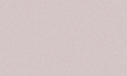

# Brightness Texturize

The Brightness Texturize augmentation creates a random noise in the brightness channel to emulate paper textures.


| Parameter   | Description                                             |
|-------------|---------------------------------------------------------|
| `range`     | The range of the brightness noise.                      |
| `deviation` | The deviation in the brightness noise.                  |
| `p`         | The probability that this augmentation will be applied. |


**Example Usage:**
```python
    from matplotlib import pyplot as plt
    from time import time
    import cv2
    import numpy as np

    start_time = time()

    # create a blank image
    image = np.full((1500, 1500, 3), 255, dtype="uint8")

    # insert text into image
    for y in range(200, 1300, 100):
        cv2.putText(
            image,
            "Lorem ipsum dolor sit amet, consectetur adipiscing elit",
            (250, y),
            cv2.FONT_HERSHEY_SIMPLEX,
            1,
            0,
            3,
        )

    brightness_texturize = BrightnessTexturize(range=(0.9, 0.99), deviation=0.1 )

    img_brightness_texturize  = brightness_texturize (image)

    elapsed_time = time() - start_time
    # processing time
    print("Elapsed time = " + str(elapsed_time) + " seconds")


    # display output
    plt.figure()
    plt.subplot(121)
    plt.imshow(image)
    plt.title("Input image")
    plt.subplot(122)
    plt.imshow(img_brightness_texturize)
    plt.title("Brightness texturized image")
```


**Example Result:**



[](https://colab.research.google.com/drive/1vi4Tytxw-4Ap1pmSULtp3UhfjU8O9G2t?usp=sharing)
